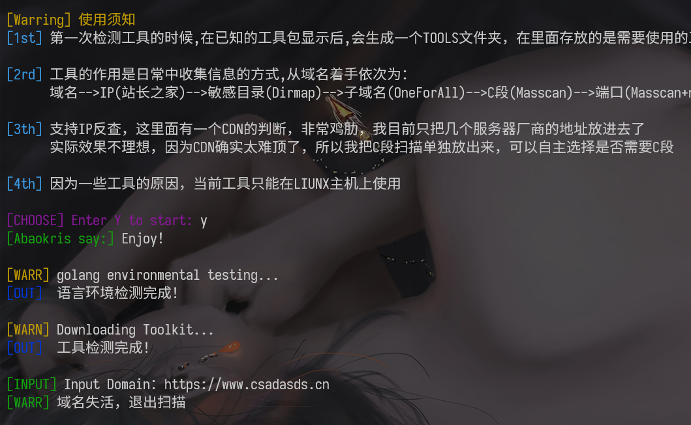
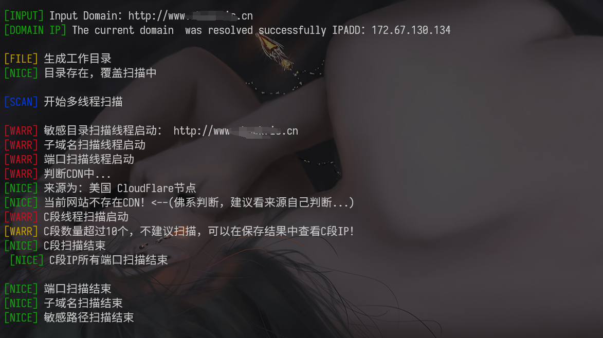
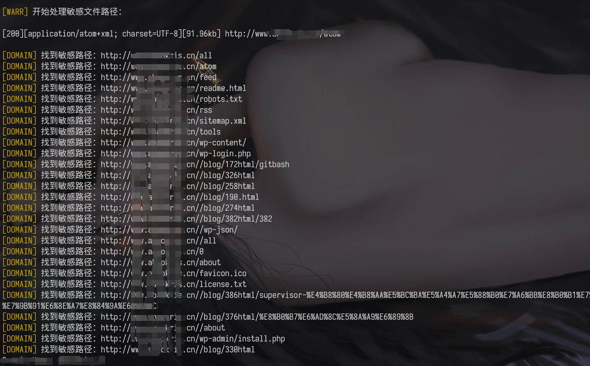
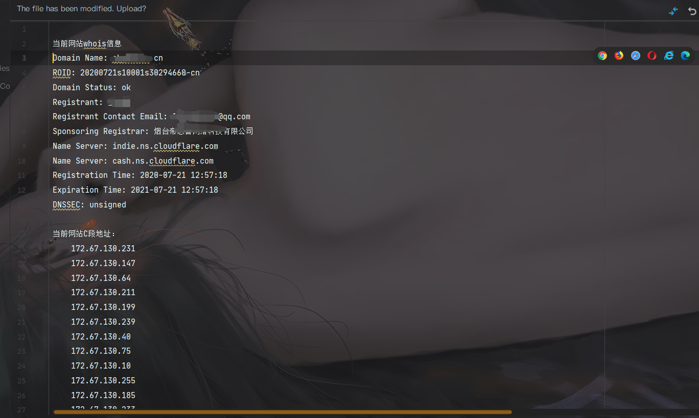
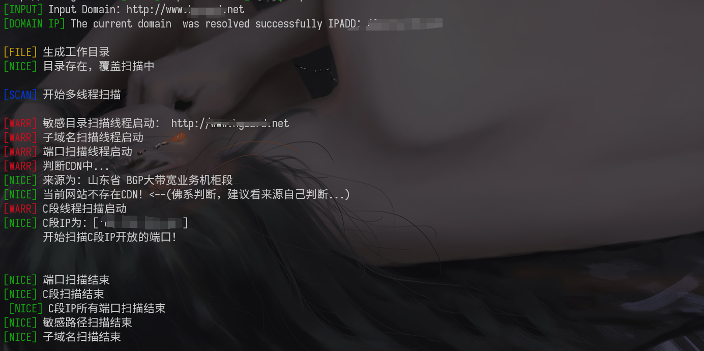
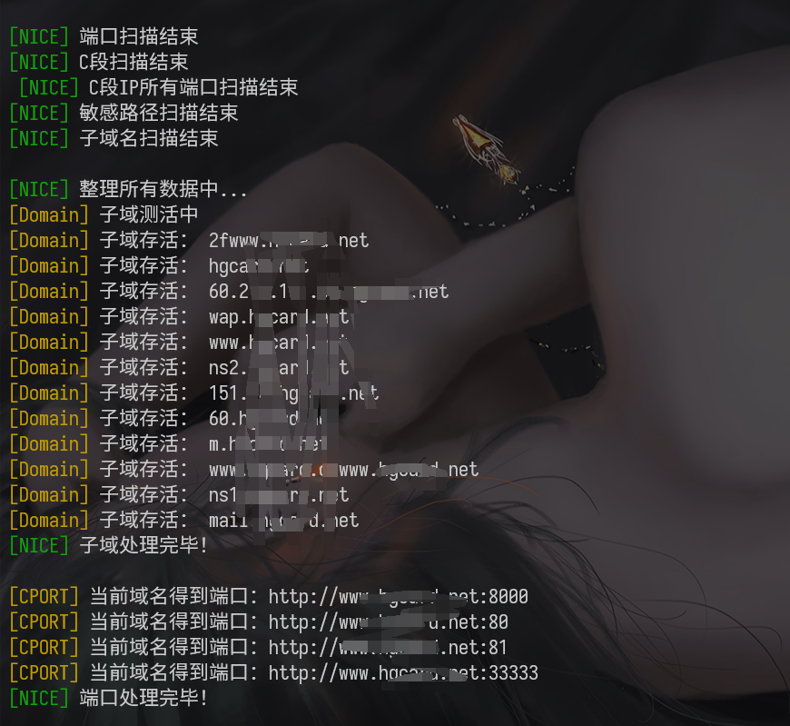

<h1 align =“ center”>RekSai</ h1>

<p>
  
  
  <a href="https://plat.wgpsec.org">
    
  </a>
</p>

> 一个信息收集的轮子！


## 开始使用

1. 除了``python3`你不需要自己安装任何一个东西，它能够自动帮你部署所有的环境和工具，除了第一次加载比较慢以外:smile:
2. 工具的原理是通过用户输入的``URL`进行信息收集，包括但不限于whois，域名对应的IP，端口、敏感目录、C段、C段的IP对应端口等
3. 但是只能在Liunx下使用！

## 使用方式

1. 语法：

   ```python
   python3 RekSai.py
   ```

   进入工具以后，你只需要输入自己的想要扫描的`URL`就行了，格式必须是`HTTP://XXX.XXX.com/cn` 或者`HTTPS://123.123.123.123` 千万要注意你的``HTTP`协议，下面是合法的格式：

   ```
   http://www.baidu.com
   http://www.baidu.cn
   https://www.baidu.com
   https://www.baidu.cn
   
   http://123.123.123.123
   https://123.123.123.123
   ```

   理论上支持加上端口，比如`http://www.baidu.com:8080`但是避免一些不必要的问题出现，还是不要用的好 /dog

2. 如果你发现你的域名是上面的格式，但是确实没有回显的话，那么请一定要``Issue`到github上。

3. CDN的判断基本上算是没啥篮子用，CDN的判断和C段的扫描挂钩，但是我整不出CDN的判断。所以只要C段IP超过10个默认就不扫描C段的IP端口了，你可以在总结文本中找到C段IP。

4. 目前不支持二级或者三级域名，后面会慢慢优化

5. 总结的信息保存在`$PWD/result/输入的域名/sumary.txt`中

6. 不建议扫描国外的网站，会很慢，当然你加代理的话，当我没说

## 使用截图：

* 域名失活：
  

* 国外：
  
  
  
  

* 

  总结文件：
  

* 国内：

  
  

  

  

国内明显快很多


## TODO

* 尝试和X-RAY配合进行漏洞扫描
* 优化域名处理，支持多级域名
* 模块化工具添加，做到想用什么工具自己就可添加，增加灵活性
* 支持批量扫描

## 💡免责声明

不能使用该工具进行非法活动，下载该工具就表示同意此条款，后续与作者无关